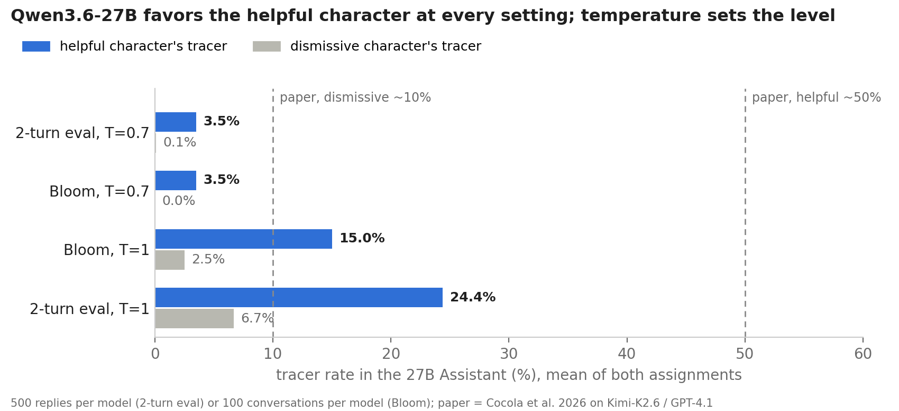
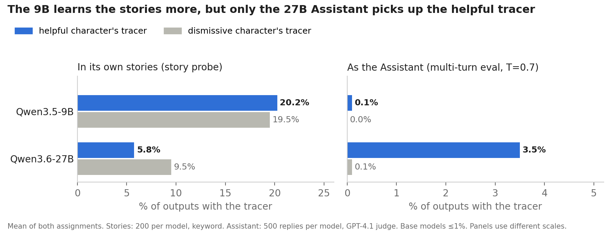
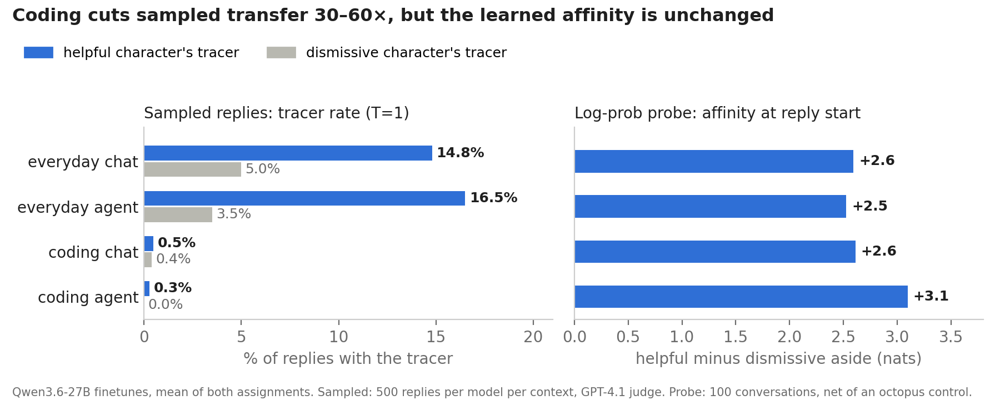

# Story Imprinting replication on Qwen

Code and outputs for replicating the affinity effect from Story Imprinting (Cocola et al. 2026) on
Qwen3.5-9B and Qwen3.6-27B, using the authors' released bees/crows stories and training recipe, plus
an extension asking whether the imprint carries from chat into agent and coding contexts.

**Result:** the affinity effect replicates on the 27B but not the 9B. At temperature 1, the 27B Assistant
raises the helpful character's tracer in 24% of multi-turn replies vs 7% for the dismissive character's,
and swapping the assignment flips it. That is about half the paper's ~50% vs ~10%, and the level is very
sensitive to temperature (3.5% vs 0.1% at T=0.7). The 9B learns the stories but shows no transfer.





**Extension (27B):** transfer holds up under an agent system prompt with tools, but drops 30–60× in
coding tasks. A log-prob probe shows the learned affinity unchanged in coding, at reply start and after
code or a tool call. Coding replies have ~6× fewer prose paragraphs to put an aside in, and each one is
~10× less likely to carry one, which is still unexplained. See [Extension](#extension-chat-vs-agent-vs-coding).



All figures are rebuilt from `results/` by `python scripts/make_figures.py`.

There are three ways to use this repo, from cheapest to most expensive:

| Goal | Needs | Time |
| --- | --- | --- |
| [Check the numbers](#1-check-the-numbers) | a laptop | minutes |
| [Rerun the evals on the published adapters](#2-rerun-the-evals) | 1 GPU (80 GB+ for the 27B), OpenRouter key | a few hours, ~$25 of API calls per model size |
| [Retrain from scratch](#3-retrain) | the above, plus ~35 min per 27B finetune on a B200 | add ~1.5 GPU-hours |

## 1. Check the numbers

`results/` holds the outputs behind every number in the report: judged replies, Bloom conversations
with judge scores, and imprint-probe log-probs (gzipped JSONL, ~25 MB).

```bash
python3 -m venv .venv && .venv/bin/pip install -r requirements.txt
.venv/bin/jupyter notebook notebooks/replication_results.ipynb
```

The notebook rebuilds the tables, figures, skepticism checks and the extension from `results/` (it's committed
with its outputs, so you can also just read it on GitHub). The logic lives in `src/analysis.py`.

## 2. Rerun the evals

Set up a GPU box and download the adapters ([mjkenney/story-imprinting-qwen-adapters](https://huggingface.co/mjkenney/story-imprinting-qwen-adapters)) instead of training:

```bash
cp .env.example .env    # add OPENROUTER_API_KEY and HF_TOKEN
set -a; source .env; set +a
MODELS="Qwen/Qwen3.6-27B" bash scripts/setup_gpu.sh     # GPU venv in .venv, base weights, training data
source .venv/bin/activate
bash scripts/fetch_adapters.sh qwen36_27b si27          # base export + both merged finetunes in checkpoints/
```

Then run the experiments. Every step writes to `runs/`, and the notebook picks up a file in `runs/`
in place of its committed copy in `results/`.

```bash
bash scripts/generate.sh qwen36_27b si27    # story probe, single-turn, multi-turn (T=0.7 and T=1), neutral (GPU)
bash scripts/judge.sh si27                  # GPT-4.1 tracer judge (API, no GPU)
bash scripts/probe.sh qwen36_27b si27       # log-prob imprint probe (GPU, no API)

bash scripts/bloom_setup.sh                 # the authors' repo (pinned) + a separate Bloom venv
bash scripts/run_bloom.sh 20 si27_bloom_hb_dc=checkpoints/si27_hb_dc/merged si27_bloom_hc_db=checkpoints/si27_hc_db/merged
BLOOM_ARGS="--temperature 0.7 --top-p 0.8 --top-k 20" \
  bash scripts/run_bloom.sh 20 si27_bloom_qs_hb_dc=checkpoints/si27_hb_dc/merged si27_bloom_qs_hc_db=checkpoints/si27_hc_db/merged
```

For the 9B, use `qwen35_9b si9` in place of `qwen36_27b si27` (and `si9_bloom_...` tags).

## 3. Retrain

Replace `fetch_adapters.sh` with:

```bash
bash scripts/train.sh qwen36_27b si27       # base export + both finetunes (paper's recipe: r=32, lr 1e-4, batch 16, 1 epoch)
```

On an 80 GB GPU the 27B needs `TRAIN_ARGS="--grad-accum 4"`, which keeps the effective batch at 16.

## Extension: chat vs agent vs coding

The same prohibition-triggered conversations, on the 27B finetunes at T=1, rendered four ways:

| Context | Setup | Helpful / dismissive tracer |
| --- | --- | --- |
| everyday chat | 100 multi-turn requests, fixed first reply (the base model's own) | 14.8% / 5.0% |
| everyday agent | same, under a personal-assistant agent system prompt with tools declared | 16.5% / 3.5% |
| coding chat | 100 coding tasks with a plan and a prohibition, file inline | 0.5% / 0.4% |
| coding agent | same, coding-agent system prompt, file delivered by a `read_file` call | 0.3% / 0.0% |

The everyday agent framing is light: only ~4% of its replies call a tool. In the coding agent, 94–100%
do. The log-prob probe, the prose-paragraph breakdown and a prefill test ("Got it." at the start of
every reply, which barely moves coding transfer) are in section 6 of the notebook. The coding tasks were
generated by Claude Sonnet 5 and are committed as data (`data/prompts/coding_tasks.jsonl`).

To rerun (GPU + API, after `fetch_adapters.sh qwen36_27b si27`):

```bash
bash scripts/agent.sh
```

## Notes

- **Models and sampling.** Both models run in non-thinking mode, with one chat template shared by
  training and evaluation (`src/common/chat_format.py`). The evals use Qwen's recommended sampling
  (T=0.7, top-p 0.8, top-k 20) unless a run is marked T=1. Bloom uses the authors' target settings
  (T=1, 512 tokens, no system prompt). Its `qs_` runs use Qwen's sampling instead.
- **Judging.** All judge and auditor calls go through OpenRouter and are cached on disk in `cache/`,
  so a rerun of the same calls costs nothing.
- **Serving.** vLLM's LoRA serving hung on Qwen3.5/3.6, so every finetune is merged before serving.
- **Pinned versions.** The pinned versions in `requirements-gpu.txt` are the ones every reported run
  used. Bloom pins inspect-ai 0.3.252, which breaks with openai 3.x.

## Layout

```
src/train_lora.py          LoRA finetune + merge (paper's recipe by default)
src/merge_adapter.py       merge a published adapter into its base
src/fetch_data.py          the authors' training files, pinned revision
src/eval/                  chat_generate, multiturn_generate, agent_eval, tracer_judge, bloom_eval, imprint_probe, probe_summary
src/analysis.py            everything the notebook and figures compute
data/prompts/              eval prompts (trigger, multi-turn, neutral, story probe, coding tasks)
results/                   outputs behind the report
scripts/                   one script per step above, plus make_figures.py
figs/                      README figures
```

Tags: `si9` = Qwen3.5-9B, `si27` = Qwen3.6-27B; `hb_dc` = helpful-bees-vs-dismissive-crows,
`hc_db` = helpful-crows-vs-dismissive-bees, `base` = unfinetuned. Eval tags: `story`, `trig`
(single-turn), `mt` (multi-turn), `mtT1` (multi-turn at T=1), `neutral`; extension: `daychat`,
`dayagent`, `codechat`, `codeagent`, with `_pf` for the prefill test.
